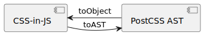

# postcss-js


Interconversion between JavaScript Object(CSS-in-JS) and
[PostCSS](https://github.com/postcss/postcss) AST

<a href="https://evilmartians.com/?utm_source=postcss-js">
  
</a>

## Usage

```ts
import {
  toAST,
  toObject,
} from "https://deno.land/x/postcss_js@$VERSION/mod.ts";
import { parse } from "https://deno.land/x/postcss_core@$VERSION/lib/postcss.js";
import { expect } from "https://deno.land/x/unitest/mod.ts";

const css = `
@media (min-width: 640px) {
  .container {
    max-width: 640px;
  }
}
`;
const ast = parse(css);
const cssInJss = toObject(ast);

expect(ast).toEqual(toAST(cssInJss));
```

## API

<div align="center">



</div>

### toAST

JavaScript Object(CSS-in-JS) to PostCSS AST

#### types

```ts
import {
  type BinaryTree,
  Root,
} from "https://deno.land/x/postcss_js@$VERSION/mod.ts";
declare function toAST(object: BinaryTree<string | number>): Root;
```

#### example

```ts
import { toAST } from "https://deno.land/x/postcss_js@$VERSION/mod.ts";
import Rule from "https://deno.land/x/postcss_core@$VERSION/lib/rule.js";
import Declaration from "https://deno.land/x/postcss_core@$VERSION/lib/declaration.js";
import AtRule from "https://deno.land/x/postcss_core@$VERSION/lib/at-rule.js";
import Root from "https://deno.land/x/postcss_core@$VERSION/lib/root.js";

import { expect } from "https://deno.land/x/unitest/mod.ts";
const style = {
  "@madia (min-width: 640px)": {
    ".container": {
      maxWidth: "640px",
    },
  },
  ".mask": {
    WebkitMask: "100%",
  },
};

const root = toAST(style);

expect(root).toEqual(
  new Root({
    nodes: [
      new AtRule({
        name: "media",
        params: "(min-width: 640px)",
        nodes: [
          new Rule({
            selector: ".container",
            nodes: [
              new Declaration({
                prop: "max-width",
                value: "640px",
              }),
            ],
          }),
        ],
      }),
      new Rule({
        selector: ".mask",
        nodes: [
          new Declaration({
            prop: "-webkit-mask",
            value: "100%",
          }),
        ],
      }),
    ],
  }),
);
```

### toObject

PostCSS AST to JavaScript Object(CSS-in-JS)

#### types

```ts
import {
  type BinaryTree,
  ChildNode,
} from "https://deno.land/x/postcss_js@$VERSION/mod.ts";
declare function toObject(ast: {
  nodes: ChildNode[];
}): BinaryTree<string | number>;
```

#### example

```ts
import { toObject } from "https://deno.land/x/postcss_js@$VERSION/mod.ts";
import Rule from "https://deno.land/x/postcss_core@$VERSION/lib/rule.js";
import Declaration from "https://deno.land/x/postcss_core@$VERSION/lib/declaration.js";
import AtRule from "https://deno.land/x/postcss_core@$VERSION/lib/at-rule.js";
import Root from "https://deno.land/x/postcss_core@$VERSION/lib/root.js";

import { expect } from "https://deno.land/x/unitest/mod.ts";

const root = new Root({
  nodes: [
    new Rule({
      selector: ".min-w-0",
      nodes: [
        new Declaration({
          prop: "min-width",
          value: "0px",
        }),
      ],
    }),
  ],
});

expect(toObject(root)).toEqual({
  ".min-w-0": {
    minWidth: "0px",
  },
});
```

## License

Copyright © 2022-present [TomokiMiyauci](https://github.com/TomokiMiyauci).

Released under the [MIT](./LICENSE) license
